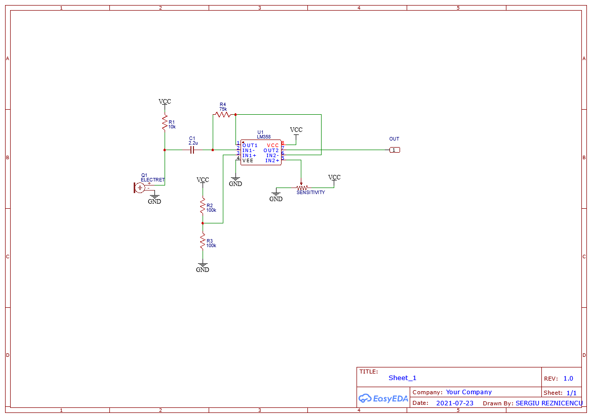

# Lateration
A method for determining the position of an event using amplified microphone data and arduino.

# How to use
Flash arduino nano/uno with the .ino sketch. Change the python script Triangulation.py:
   - change serial port with the one currently used
   - change `total_length` to the exact distance (in cm) between the two microphones

The python script needs an initial calibration to account for the timming differences between mic-opamp-arduino circuits. There are two such Linear Regression models for each microphone. Each one is activated depending on which microphone was 'triggered' by the sound wave last.

   1. Make a very precise and sharp sound near Mic1(represented by A1 pin input). The distance should not be bigger than half the total length or the other mic will be activated; remember the coordinate. This activates the calibration for the second mic. 
   2. Enter the **x coordinate** at which you made the sound in the python script. 
   3. Repeat the process with another point near Mic1. 
   4. Calibrate. Now the Linear Regression for **Mic2** is done.
   5. Repeat the above steps to calibrate **Mic1** by making sharp noises near **Mic2**. The calibration is always referenced to **Mic1** and is the coordinate at which the sound was made. No need to account for the currently calibrated mic.

   After the initial calibration any point between the two microphones should be determined within **1 cm** accuracy! Precision is not very high meaning one measurement or two are needed to 'hit' on the 1 cm precision. This is due to the fact that the first sound wave is missed by one of the mics and only the next echo triggers it.
   
   
# How it works
The arduino scripts counts how many `cycles` pass between the first sound event and the second one while retaining the order of the events. This data is communicated over serial to the python scripts which uses a Linear Regression model to translate the cycle counts to actual distance. Then the distance is translated to a `x coordinate` which is relative to `Mic1`. 

The calibration also uses the coordinate system and not the length between one or the other microphone.

# Circuit

